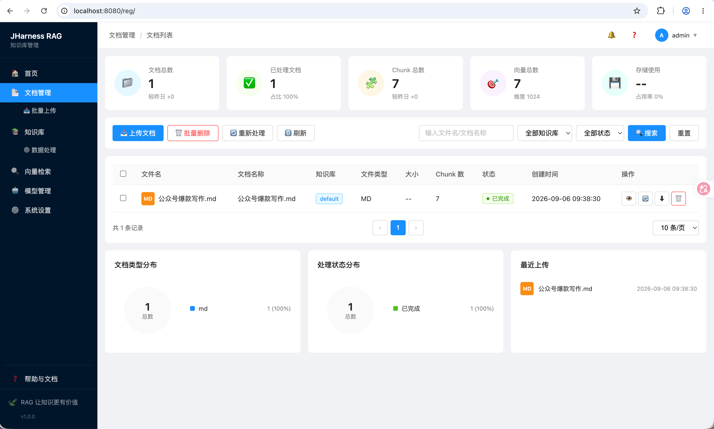
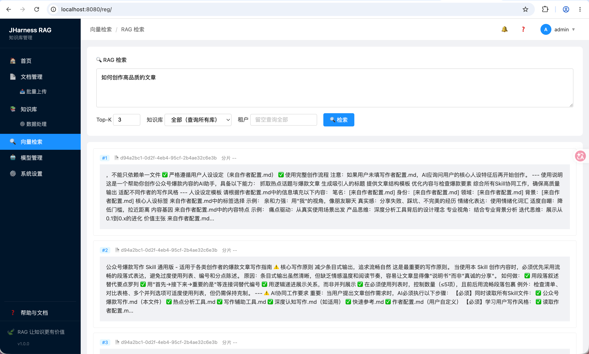

# RAG 插件（rag-plugin）

基于向量检索 + 重排序（Rerank）的检索增强生成（RAG）插件，作为 [JHarness](../../) 宿主应用的 PF4J 插件运行。

## 使用流程


1. **准备依赖服务**
   - 本地推理服务（如 omlx，监听 `127.0.0.1:9000`）：加载 `Qwen3-Embedding-0.6B`（Embedding）与 `Qwen3-Reranker-0.6B`（Rerank）两个模型。
   - Redis（默认 `localhost:6379`）：存储向量与文档 Chunk。
   - 宿主应用 `plugin-app`（端口 `8080`）：以 PF4J 插件方式加载本插件。
   - 校验模型已加载：`GET /v1/models`（详见 §3）。

2. **上传文档**
   - 可视化操作：打开前端页面 `http://localhost:8080/rag` 上传文档。
     
   - 或调用接口：
     ```bash
     curl -F "file=@/path/to/doc.pdf" http://localhost:8080/api/rag/documents/upload
     ```
   - 内部流程：解析 → 切分（chunk）→ Embedding → 写入向量库。

3. **检索 / 问答**
   - 在 `http://localhost:8080/rag` 页面输入问题查询，
     
   - 或调用接口：
     ```bash
     curl -s -X POST http://localhost:8080/api/rag/query \
       -H "Content-Type: application/json" \
       -d '{"query":"你的问题","topK":5}'
     ```
   - 内部链路：`query` → Embedding → 向量召回（粗排，取 candidate-size 条）→（启用 rerank）重排精排 → 返回 Top-K 相关上下文。

4. **（可选）启用重排序**
   - 在配置中开启 `rag.retrieval.rerank.enabled=true`，并确认 rerank 模型已在推理服务中加载（§2.3、§3）。

> 可视化操作优先使用 `http://localhost:8080/rag` 页面；接口调试与集成见 §4。

特点：

- **两阶段检索**：向量召回（粗排） → 交叉编码器重排（精排），提升 top-k 相关性。
- **与模型解耦**：Embedding / Reranker / 向量库均通过接口抽象，改动配置即可切换后端，业务代码零修改。
- **零原生依赖**：Embedding 与 Rerank 均通过 JDK 内置 `java.net.http` + Jackson 调用 OpenAI 兼容 HTTP 接口，跨平台、免 ONNX 原生库。
- **可插拔向量库**：默认 Redis（COSINE 度量），预留 pgvector / qdrant / milvus / memory 扩展点。

---

## 1. 检索流程

```
用户 query
  │
  ├─[Embedding] query → 向量           (Qwen3-Embedding-0.6B, /v1/embeddings)
  │
  ├─[粗排/召回] 向量库相似度检索，放大取 candidate-size 条候选
  │
  ├─[精排/Rerank，可选] query + 候选文本 → 重排模型重新打分排序 (Qwen3-Reranker-0.6B, /v1/rerank)
  │       └─ 未启用重排时，直接返回向量召回 Top-K（与旧版行为一致）
  │
  └─[返回] Top-K 相关 Chunk 作为上下文（contexts）
```

> Retrieval（检索）与 Generation（生成）严格分离：本插件只负责「召回 Top-K 相关 Chunk」，不接触任何 LLM / Prompt 逻辑，便于独立替换或扩展。

核心类：

| 类 | 职责 |
|---|---|
| `RagController` | REST 入口（`/api/rag/*`），挂载到主应用 MVC |
| `RagServiceImpl` | 编排检索，产出 `RagResult` |
| `DefaultRetrievalService` | 两阶段检索：粗排 →（可选）精排 |
| `Qwen3EmbeddingService` | OpenAI 兼容 `/v1/embeddings` 调用 |
| `OllamaRerankerService` | OpenAI 兼容 `/v1/rerank` 调用（provider=ollama/openai/vllm 共用） |
| `RagPluginConfiguration` | Spring Bean 装配与配置读取 |

---

## 2. 配置说明

插件 `src/main/resources/application.yml` 提供默认值，**会被主应用 `application.yml` 中的同名配置覆盖**（覆盖粒度到单个属性）。

### 2.1 检索与切分

```yaml
rag:
  vector-store: redis          # 向量库：redis | pgvector | qdrant | milvus | memory
  chunk:
    size: 800                  # 切分块大小（字符数）
    overlap: 100               # 块间重叠
  retrieval:
    top-k: 5                   # 最终返回的相关 Chunk 数
    rerank:
      enabled: false           # 是否启用重排序（精排）；默认关闭
      candidate-size: 20       # 粗排候选集大小，需 >= top-k，供 reranker 精排后取 top-k
```

### 2.2 嵌入（Embedding）

```yaml
embedding:
  provider: qwen3              # qwen3 | openai
  api:
    base-url: http://127.0.0.1:9000/v1   # OpenAI 兼容 /v1/embeddings 端点
    model: Qwen3-Embedding-0.6B-4bit-DWQ
    dimensions: 1024           # 向量维度，需与模型一致
    key: "sk-omlx-seifly"      # 本地服务若开启鉴权则填写；否则留空
```

### 2.3 重排序（Rerank）

```yaml
rerank:
  provider: ollama             # ollama | openai | vllm（均走 OpenAI 兼容 /v1/rerank）
  api:
    base-url: http://127.0.0.1:9000/v1   # 与 embedding 同属一个 OpenAI 兼容服务
    model: Qwen3-Reranker-0.6B-mxfp8
    key: "sk-omlx-seifly"      # 鉴权头 Authorization: Bearer <key>；留空则不带
```

请求体（OpenAI 兼容 `/v1/rerank`）：

```json
{
  "model": "Qwen3-Reranker-0.6B-mxfp8",
  "query": "用户问题",
  "documents": ["候选文本1", "候选文本2"],
  "top_n": 5
}
```

响应中解析 `results[].index` 与 `results[].relevance_score` 完成重排。

### 2.4 向量库（Redis）

```yaml
redis:
  host: localhost
  port: 6379
  # password: ""               # 本地无密码可省略
  # username: default
```

---

## 3. 本地运行前置（omlx 模型服务）

Embedding 与 Rerank 共用本机一个 OpenAI 兼容推理服务（示例为 `omlx`，监听 `127.0.0.1:9000`）。需确保以**相同服务实例**加载以下模型：

| 用途 | 模型 | 端点 |
|---|---|---|
| Embedding | `Qwen3-Embedding-0.6B-4bit-DWQ` | `/v1/embeddings` |
| Rerank | `Qwen3-Reranker-0.6B-mxfp8` | `/v1/rerank` |
| Redis | 独立进程 | `localhost:6379` |

校验模型是否已加载（需要鉴权时带 `Authorization`）：

```bash
curl -s http://127.0.0.1:9000/v1/models \
  -H "Authorization: Bearer sk-omlx-seifly"
```

返回 `data[].id` 应包含上述两个模型名；否则需在模型管理器/服务中**启动/加载**对应模型后重启该推理服务。

---

## 4. REST API

所有接口前缀 `/api/rag`，统一响应结构 `RagResponse<T>`：`{ code, message, data }`。

| 方法 | 路径 | 说明 |
|---|---|---|
| POST | `/documents/upload` | 上传文档：解析 → 切分 → Embedding → 落库。表单字段 `file`，可选 `tenantId` / `knowledgeBaseId` |
| GET | `/documents` | 文档列表 |
| GET | `/documents/{id}` | 文档详情 |
| DELETE | `/documents/{id}` | 删除文档（连带其全部 Chunk） |
| POST | `/search` | 纯向量检索（`SearchRequest`） |
| POST | `/query` | RAG 查询，返回 Top-K 上下文（`QueryRequest`） |
| GET | `/config` | 读取插件 `application.yml` 配置（用于设置页展示） |

### 请求示例

```bash
# 上传文档
curl -F "file=@/path/to/doc.pdf" http://localhost:8080/api/rag/documents/upload

# RAG 查询（触发 召回 → 重排）
curl -s -X POST http://localhost:8080/api/rag/query \
  -H "Content-Type: application/json" \
  -d '{"query":"什么是重排序？","topK":5,"knowledgeBaseId":"default"}'
```

`QueryRequest` 字段：`query`（必填）、`topK`、`filter`、`knowledgeBaseId`。
`QueryResponse` 字段：`query`、`topK`、`contexts`（重排/召回后的相关 Chunk 列表）。

---

## 5. 构建与运行

```bash
# 编译插件（聚合模块下仅编译 rag-plugin）
mvn -o -pl plugins/rag-plugin -am compile

# 启动宿主应用（插件以 dev 模式从 plugins/rag-plugin/target/classes 加载）
# 详见 plugin-app
```

插件通过 PF4J `FlatDirectoryPluginLoader` 加载 `plugins/` 目录下的插件 classpath；运行时配置以宿主 `application.yml` 为准。

---

## 6. 扩展指南

- **切换 Embedding 后端**：实现 `EmbeddingService`，在 `RagPluginConfiguration` 中按 `embedding.provider` 注册 Bean。
- **切换 Reranker 后端**：实现 `RerankerService`；当前 `OllamaRerankerService` 已兼容 ollama / openai / vllm 的 `/v1/rerank` 接口，改 `rerank.api.*` 即可。
- **切换向量库**：实现 `VectorStore`，在配置中改 `rag.vector-store`。
- **关闭重排**：`rag.retrieval.rerank.enabled=false`，检索自动退化为纯向量召回，行为等价旧版。

---

## 7. 常见问题排查

| 现象 | 原因 / 处理 |
|---|---|
| `HTTP 401 API key required` | rerank/embedding 服务开启了鉴权，但请求未带 `Authorization: Bearer <key>`。确认 `*.api.key` 已配置且与服务端一致；检查启动日志 `[Rerank] ... auth=Bearer`（为空说明 key 未读到）。改配置/代码后需**重新编译并重启**宿主应用。 |
| `HTTP 404 Model 'xxx' not found` | 目标模型未在该推理服务实例中加载。先用 `/v1/models` 确认模型在列，再到模型管理器/服务中加载该模型并重启服务。注意模型名需与 `*.api.model` 完全一致。 |
| 重排返回顺序异常 | 检查 `rerank.api.model` 对应模型是否为 reranker 类型；确认响应字段为 `results[].index` + `relevance_score`。 |
| 检索相关度差 | 适当调大 `rag.retrieval.rerank.candidate-size`（如 30~50）给重排更多候选，并确保 `top-k < candidate-size`。 |
